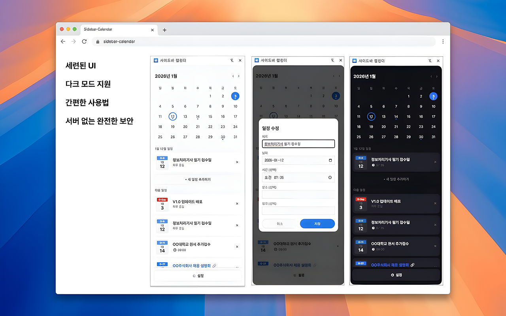

# 🗓️ Sidebar Calendar

**웹 서핑의 흐름을 방해하지 않는 가장 스마트한 일정 관리**

사이드바 캘린더는 크롬 사이드바를 활용하여 사용자가 웹 서핑이나 업무 흐름을 끊지 않고도 완벽하게 일정을 관리할 수 있도록 돕는 생산성 도구입니다.

---

## 한글 설명 (Korean)

### **주요 특징**

- ✨ **드래그 한 번으로 일정 등록**
  - 웹페이지에서 날짜가 포함된 텍스트를 드래그만 하세요. 복잡한 타이핑 없이 즉시 일정을 추가할 수 있습니다.
- 📍 **사이드바 상시 거치**
  - 크롬 사이드바에 고정하여 사용하세요. 웹 서핑 중에도 언제든 사이드바를 열어 일정을 확인하고 관리할 수 있어 업무 효율이 극대화됩니다.
- 🎨 **직관적인 D-Day 시각화**
  - 일정이 다가올수록 D-Day 칩의 색상이 변화(파란색 → 빨간색)합니다. 어떤 일정이 가장 시급한지 한눈에 파악하세요.
- 🔔 **강력한 스마트 알림**
  - 중요한 약속이나 마감일을 절대 놓치지 마세요. 설정한 알림 시간에 맞춰 브라우저 푸시 알림을 보내드립니다.
- 🌓 **모던한 UI & 다크 모드**
  - 깔끔한 머티리얼 디자인을 적용하였으며, 시스템 설정에 맞춰 다크 모드와 라이트 모드를 완벽하게 지원합니다.
- 📝 **상세 정보 관리**
  - 제목, 시간, 장소는 물론 관련 링크까지 기록하여 일정에 필요한 모든 정보를 한곳에 모아보세요.

---

## English Description

### **Key Features**

- ✨ **One-Drag Event Creation**
  - Simply drag text containing a date from any webpage. Add events instantly without tedious typing.
- 📍 **Always-Ready Sidebar**
  - Keep your calendar fixed in the Chrome Sidebar. Check and manage your schedule anytime while browsing—perfect for boosting productivity.
- 🎨 **Visual D-Day Urgency**
  - Watch your D-Day chips change color as the deadline approaches (Blue for future, Red for urgent). Prioritize your tasks at a single glance.
- 🔔 **Smart Notifications**
  - Never miss an important meeting or deadline again. Receive browser notifications based on your custom lead time.
- 🌓 **Modern UI & Dark Mode**
  - Featuring a clean, Material-inspired design with full support for both Dark and Light modes to match your system preferences.
- 📝 **Detailed Event Management**
  - Save more than just dates. Keep titles, times, locations, and even links all in one organized place.
